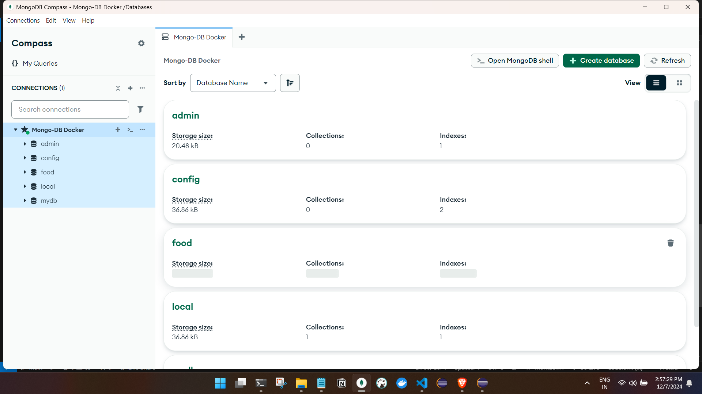
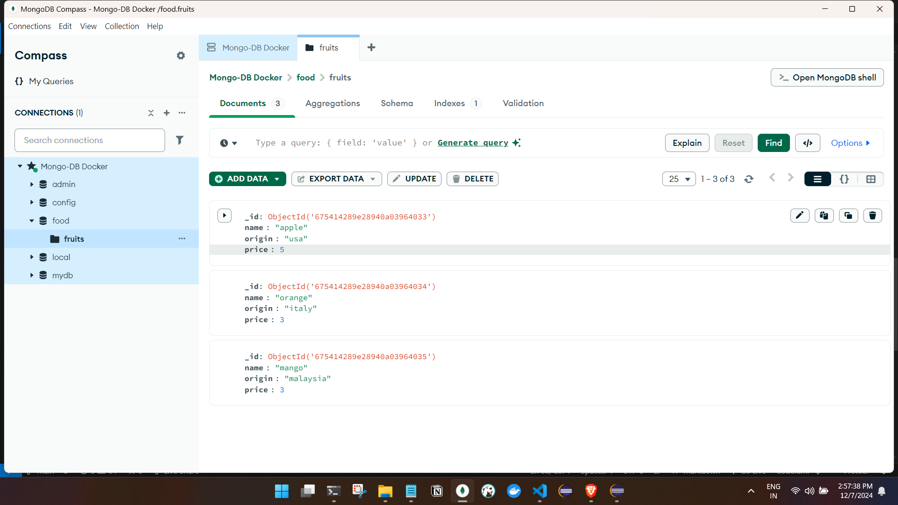

To access your MongoDB container via the terminal and perform basic operations, follow these steps:

## Accessing the MongoDB Container

1. **Open the Terminal**: Start by opening your terminal.

2. **Use Docker Exec Command**: To access the terminal of your running MongoDB container, execute the following command:
   ```bash
    docker exec -it e9a416d7d199 bash
   ```
   Here, `e9a416d7d199` is your container ID. This command opens an interactive bash shell inside the container[1][2].

3. **Start MongoDB Shell**: Once inside the container, you can start the MongoDB shell by typing:
   ```bash
   mongosh
   ```
   If you are using a newer version of MongoDB, you may need to use `mongosh` instead[3][4].

## Performing Basic Operations

Once you are in the MongoDB shell, you can perform various operations:

1. **Create a Database**: To create or switch to a database named "food", use:
   ```javascript
   use food
   ```

2. **Create a Collection**: To create a collection named "fruits", run:
   ```javascript
   db.createCollection("fruits")
   ```

3. **Insert Documents**: You can insert documents into the "fruits" collection with:
   ```javascript
   db.fruits.insertMany([
       { name: "apple", origin: "usa", price: 5 },
       { name: "orange", origin: "italy", price: 3 },
       { name: "mango", origin: "malaysia", price: 3 }
   ])
   ```

4. **Query Documents**: To retrieve and display all documents in the "fruits" collection, use:
   ```javascript
   db.fruits.find().pretty()
   ```

5. **Exit the Shell**: When you're done, you can exit both the MongoDB shell and the container shell by typing:
   ```bash
   exit
   ```

## Summary of Commands

| Operation                  | Command                                                                                      |
|----------------------------|----------------------------------------------------------------------------------------------|
| Access Container            | `sudo docker exec -it e9a416d7d199 bash`                                                   |
| Start MongoDB Shell        | `mongo` or `mongosh`                                                                        |
| Create/Switch Database     | `use food`                                                                                   |
| Create Collection           | `db.createCollection("fruits")`                                                             |
| Insert Documents            | `db.fruits.insertMany([...])`                                                               |
| Query Documents             | `db.fruits.find().pretty()`                                                                  |
| Exit                       | `exit`                                                                                       |

- Verifying from MongoDB compass GUI :





By following these steps, you can effectively manage your MongoDB instance running in a Docker container directly from your terminal.


## Under standing Update and Delete operations:

- Connect to MongoDB from the terminla or use mongodb shell from the compass GUI.

```
For mongosh info see: https://www.mongodb.com/docs/mongodb-shell/

------
   The server generated these startup warnings when booting
   2024-12-07T09:03:08.829+00:00: Using the XFS filesystem is strongly recommended with the WiredTiger storage engine. See http://dochub.mongodb.org/core/prodnotes-filesystem
   2024-12-07T09:03:09.641+00:00: Access control is not enabled for the database. Read and write access to data and configuration is unrestricted
   2024-12-07T09:03:09.641+00:00: For customers running the updated tcmalloc-google memory allocator, we suggest setting the contents of sysfsFile to 'defer+madvise'
   2024-12-07T09:03:09.641+00:00: We suggest setting the contents of sysfsFile to 0.
   2024-12-07T09:03:09.641+00:00: Your system has glibc support for rseq built in, which is not yet supported by tcmalloc-google and has critical performance implications. Please set the environment variable GLIBC_TUNABLES=glibc.pthread.rseq=0
   2024-12-07T09:03:09.641+00:00: vm.max_map_count is too low
   2024-12-07T09:03:09.641+00:00: We suggest setting swappiness to 0 or 1, as swapping can cause performance problems.
------

test> use food
switched to db food
food> db["fruits"].find().pretty()
[
  {
    _id: ObjectId('675414289e28940a03964033'),
    name: 'apple',
    origin: 'usa',
    price: 5
  },
  {
    _id: ObjectId('675414289e28940a03964034'),
    name: 'orange',
    origin: 'italy',
    price: 3
  },
  {
    _id: ObjectId('675414289e28940a03964035'),
    name: 'mango',
    origin: 'malaysia',
    price: 3
  }
]
food>
```

## Now that we have our `fruits` collection set up in the `food` database, let's go through how to perform update and delete operations on the documents in this collection.

## Update Operations

### 1. Update a Single Document

To update a single document, you can use the `updateOne()` method. For example, if you want to change the price of the fruit "apple" to 6, you would do the following:

```javascript
db.fruits.updateOne(
    { name: "apple" }, // Filter
    { $set: { price: 6 } } // Update operation
)
```

### 2. Update Multiple Documents

If you want to update multiple documents at once, you can use the `updateMany()` method. For example, if you want to increase the price of all fruits from "malaysia" by 1:

```javascript
db.fruits.updateMany(
    { origin: "malaysia" }, // Filter
    { $inc: { price: 1 } } // Increment operation
)
```

## Delete Operations

### 1. Delete a Single Document

To delete a single document, use the `deleteOne()` method. For instance, if you want to remove the document for "orange":

```javascript
db.fruits.deleteOne(
    { name: "orange" } // Filter
)
```

### 2. Delete Multiple Documents

If you want to delete multiple documents that match a certain condition, use the `deleteMany()` method. For example, if you want to remove all fruits that are from "malaysia":

```javascript
db.fruits.deleteMany(
    { origin: "malaysia" } // Filter
)
```

## Example Workflow

Here’s an example workflow combining both update and delete operations:

1. **Update Apple Price**:
   ```javascript
   db.fruits.updateOne(
       { name: "apple" },
       { $set: { price: 6 } }
   )
   ```

2. **Increase Price of Malaysian Fruits**:
   ```javascript
   db.fruits.updateMany(
       { origin: "malaysia" },
       { $inc: { price: 1 } }
   )
   ```

3. **Delete Orange**:
   ```javascript
   db.fruits.deleteOne(
       { name: "orange" }
   )
   ```

4. **Delete All Malaysian Fruits**:
   ```javascript
   db.fruits.deleteMany(
       { origin: "malaysia" }
   )
   ```

## Summary of Commands

| Operation                     | Command                                                                                     |
|-------------------------------|---------------------------------------------------------------------------------------------|
| Update Single Document        | `db.fruits.updateOne({ name: "apple" }, { $set: { price: 6 } })`                         |
| Update Multiple Documents      | `db.fruits.updateMany({ origin: "malaysia" }, { $inc: { price: 1 } })`                  |
| Delete Single Document        | `db.fruits.deleteOne({ name: "orange" })`                                                |
| Delete Multiple Documents      | `db.fruits.deleteMany({ origin: "malaysia" })`                                           |

By using these commands, we can effectively manage your MongoDB collection by updating and deleting documents as needed. If you have any specific scenarios or further questions, feel free to ask!

### Note :  Deleting from ID.


Citations:
[1] https://www.bmc.com/blogs/mongodb-docker-container/
[2] https://earthly.dev/blog/mongodb-docker/
[3] https://stackoverflow.com/questions/32944729/how-to-start-a-mongodb-shell-in-docker-container
[4] https://forums.docker.com/t/how-mongodb-work-in-docker-how-to-connect-with-mongodb/44763
[5] https://tsmx.net/docker-local-mongodb/
[6] https://www.geeksforgeeks.org/how-to-run-mongodb-as-a-docker-container/