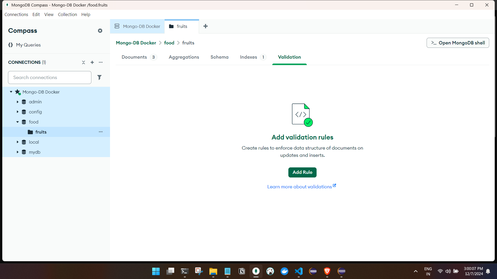

### **1. What is MongoDB?**
MongoDB is a **NoSQL database** that stores data in a flexible, JSON-like format called BSON (Binary JSON). Unlike traditional SQL databases, it does not rely on fixed schemas or tables and is designed to scale horizontally.

---

### **2. Why MongoDB?**
- **Flexible Schema**: No need to predefine structure (schema). Fields can vary from document to document.
- **Scalability**: Built for horizontal scaling with sharding.
- **Speed**: Optimized for high-volume read/write operations.
- **Rich Queries**: Supports complex queries and aggregations similar to SQL.

---

### **3. Scenarios Where MongoDB Excels**
- **Dynamic or Evolving Schema**: If your data structure keeps changing (e.g., user profiles, IoT sensor data).
- **Big Data**: MongoDB handles massive datasets with ease.
- **Real-time Analytics**: Ideal for dashboards or analytics in e-commerce or media platforms.
- **Geospatial Data**: Applications needing geolocation queries, like ride-sharing apps.
- **Content Management**: Blogs, news sites, or applications with varied content types.

---

### **4. MongoDB vs SQL: Key Features**
| **Feature**           | **SQL**                         | **MongoDB**                  |
|------------------------|----------------------------------|------------------------------|
| **Data Model**         | Tables with rows and columns    | Documents with key-value pairs (JSON-like) |
| **Schema**             | Predefined schema               | Flexible schema              |
| **Joins**              | Supported (e.g., INNER JOIN)    | Not directly supported (use `$lookup`) |
| **Scalability**        | Vertical                        | Horizontal                   |
| **Transactions**       | ACID                            | ACID (since v4.0 for multi-docs) |
| **Query Language**     | SQL                             | MongoDB Query Language (JSON-based) |
| **Indexes**            | Primary/Secondary/Composite     | Single field/Compound/Geospatial |

---

### **5. SQL Concepts and Their MongoDB Counterparts**

#### **DDL and DML**
- **DDL (Data Definition Language)**:
  - SQL: `CREATE`, `ALTER`, `DROP`
  - MongoDB: No explicit DDL. Collections are created when a document is inserted.
  
- **DML (Data Manipulation Language)**:
  - SQL: `SELECT`, `INSERT`, `UPDATE`, `DELETE`
  - MongoDB:
    - `find()` → SQL `SELECT`
    - `insertOne()` / `insertMany()` → SQL `INSERT`
    - `updateOne()` / `updateMany()` → SQL `UPDATE`
    - `deleteOne()` / `deleteMany()` → SQL `DELETE`

#### **Indexes**
- SQL: `CREATE INDEX ON table_name(column_name);`
- MongoDB: `db.collection.createIndex({ field: 1 });`  
  - Indexing boosts query performance. MongoDB supports unique, compound, TTL (Time-To-Live), and geospatial indexes.

#### **Joins**
- SQL: Joins are native (e.g., `INNER JOIN`, `LEFT JOIN`).
- MongoDB: No joins by default. Use the `$lookup` aggregation operator for join-like behavior between collections.

#### **Views**
- SQL: Materialized or virtual views (`CREATE VIEW ...`).
- MongoDB: Introduced in newer versions as `db.createView()`, mainly for read-only queries.

#### **Aggregation Framework**
- SQL: Aggregate functions like `SUM`, `COUNT`, `GROUP BY`.
- MongoDB: 
  - Use the `$aggregate` pipeline.
  - Example: `{ $group: { _id: "$category", total: { $sum: "$amount" } } }`

---
- Note : DB and Collection looks liks :



### **6. MongoDB Operations Cheat Sheet**

#### **Common CRUD Operations**
```javascript
// Create
db.collection.insertOne({ name: "Ashfaq", age: 28 });

// Read
db.collection.find({ name: "Ashfaq" }); // SELECT * FROM table WHERE name='Ashfaq'

// Update
db.collection.updateOne({ name: "Ashfaq" }, { $set: { age: 29 } });

// Delete
db.collection.deleteOne({ name: "Ashfaq" });
```

#### **Advanced Queries**
- **Projection** (selecting specific fields):
  ```javascript
  db.collection.find({}, { name: 1, _id: 0 }); // SELECT name FROM table
  ```
- **Sorting**:
  ```javascript
  db.collection.find().sort({ age: -1 }); // ORDER BY age DESC
  ```
- **Pagination**:
  ```javascript
  db.collection.find().skip(10).limit(5); // OFFSET 10 LIMIT 5
  ```

#### **Index Creation**
```javascript
db.collection.createIndex({ name: 1 }); // Index on name in ascending order
```

#### **Joins Using `$lookup`**
```javascript
db.orders.aggregate([
  {
    $lookup: {
      from: "customers",   // Join with 'customers' collection
      localField: "cust_id",
      foreignField: "_id",
      as: "customer_info"
    }
  }
]);
```

#### **Aggregation Framework**
Example: Total sales by category.
```javascript
db.sales.aggregate([
  { $group: { _id: "$category", totalSales: { $sum: "$amount" } } },
  { $sort: { totalSales: -1 } }
]);
```

---

### **7. Important MongoDB Features**
- **Document Validation**: Set rules for schema validation.
- **Replica Sets**: Ensures high availability.
- **Sharding**: Distributes data across multiple servers.
- **Geospatial Queries**: For location-based applications.
- **Change Streams**: Real-time data updates for reactive systems.

---

### **8. MongoDB in Real Scenarios**
- **E-commerce**: Flexible schemas for product catalogs (fields can vary per product).
- **Social Media**: Fast retrieval and flexible data for posts, likes, and comments.
- **Real-Time Analytics**: Aggregations for live dashboards.

---

### How SQL Concepts Apply in MongoDB?
MongoDB provides alternatives for almost every SQL concept, though the design is different due to its NoSQL nature. Where SQL is relational, MongoDB is more like working with a hierarchical or document-based model.

---
