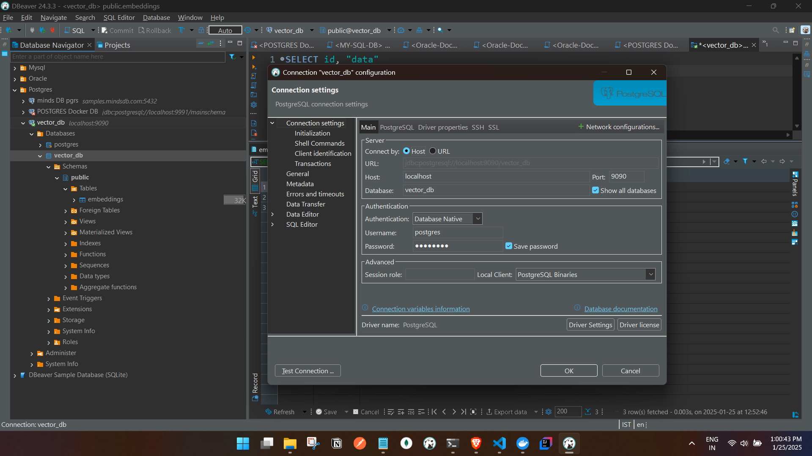
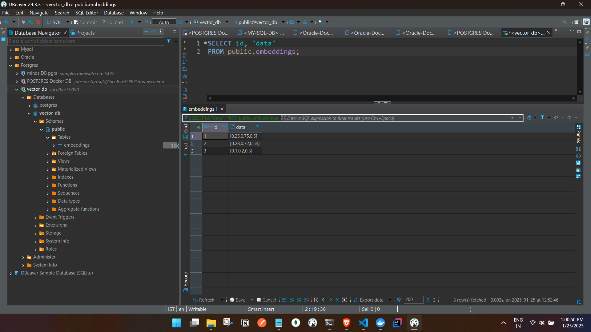

PostgreSQL does support vector databases using extensions like **pgvector**, which is commonly used for AI applications, particularly for storing and querying embeddings. Let’s break this down step by step:

### 1. **What is a Vector Database?**
   - A vector database is designed to store and query high-dimensional vectors (e.g., embeddings). 
   - ``Embeddings are numerical representations of data`` (like text, images, or audio) in a fixed-dimensional space. These vectors capture semantic meaning.
   - For example:
     - The word "king" might be represented as `[0.25, 0.75, 0.5]`.
     - The word "queen" might be close to it in vector space as `[0.28, 0.72, 0.53]`.

### 2. **Why Embeddings and Vectors?**
   - In AI, embeddings are used because they allow ``similarity searches``.
   - Example: If you search for "king," the system can find "queen" because their embeddings are close in vector space.

### 3. **PostgreSQL with pgvector Extension**
   - The **pgvector** extension enables PostgreSQL to act as a vector database.
   - You can store vectors and perform operations like:
     - **Nearest neighbor searches** for similarity.
     - **Cosine similarity**, **Euclidean distance**, etc.

---

### 4. **Setting up PostgreSQL with Docker Compose**
Here’s how you can set it up:

#### Docker Compose File (docker-compose.yml)
```yaml
version: '3.9'
services:
  postgres:
    image: ankane/pgvector   # Includes PostgreSQL with pgvector pre-installed
    container_name: postgres_vector_db
    environment:
      POSTGRES_USER: postgres
      POSTGRES_PASSWORD: postgres
      POSTGRES_DB: vector_db
    ports:
      - "9090:5432"
    volumes:
      - pgdata:/var/lib/postgresql/data

volumes:
  pgdata:
```

#### Steps:
1. Save the file as `docker-compose.yml`.
2. Run the command:
   ```bash
   docker-compose up -d
   ```
3. Access the database using any SQL client like **pgAdmin**, **DBeaver**, or CLI tools.

---

### 5. **Performing Transactions**
After connecting to the database, you can create a table for vectors and insert embeddings.

#### Example SQL:
```sql
-- Enable pgvector
CREATE EXTENSION IF NOT EXISTS vector;

-- Create a table for vectors
CREATE TABLE embeddings (
    id SERIAL PRIMARY KEY,
    data VECTOR(3) -- A vector of dimension 3
);

-- Insert data (Example 3D vectors)
INSERT INTO embeddings (data) VALUES
  ('[0.25, 0.75, 0.5]'),
  ('[0.28, 0.72, 0.53]'),
  ('[0.1, 0.2, 0.3]');

-- Find the most similar vector
SELECT id, data
FROM embeddings
ORDER BY data <-> '[0.26, 0.73, 0.52]'::vector
LIMIT 1; -- Nearest neighbor
```

---

### 6. **Concept of Embeddings**
- **Input Data:** Text, images, etc.
- **Embedding:** A numerical vector representing the input's meaning. Models like **Word2Vec**, **BERT**, or **OpenAI Embeddings API** generate these vectors.
- Example:
  - Text: "This is an AI query."
  - Embedding: `[0.12, 0.98, 0.34, ..., 0.87]` (hundreds or thousands of dimensions).

---

Now that we’ve set up the basics, you can start experimenting with embeddings in PostgreSQL and explore their use in AI applications.  


## Running the  PG_vector DB Image :
- Note we will run a simple PostgreSQL container with the pgvector extension pre-installed.
- If extension does not exist we will create the extension, this extesion is needed for the vector data type.


## Connecting and inserting data from CLI:

```


C:\Users\ashfa>docker ps
CONTAINER ID   IMAGE             COMMAND                  CREATED          STATUS          PORTS                    NAMES
6301b6479300   ankane/pgvector   "docker-entrypoint.s…"   19 minutes ago   Up 19 minutes   0.0.0.0:9090->5432/tcp   postgres_vector_db

C:\Users\ashfa>docker exec -it 6301b6479300   bash
root@6301b6479300:/# psql -U postgres -d vector_db
psql (15.4 (Debian 15.4-2.pgdg120+1))
Type "help" for help.

vector_db=# CREATE EXTENSION IF NOT EXISTS vector;
CREATE EXTENSION
vector_db=# CREATE TABLE embeddings (
    id SERIAL PRIMARY KEY,
    data VECTOR(3) -- A vector of dimension 3
);
CREATE TABLE
vector_db=# INSERT INTO embeddings (data) VALUES
  ('[0.25, 0.75, 0.5]'),
  ('[0.28, 0.72, 0.53]'),
  ('[0.1, 0.2, 0.3]');
INSERT 0 3
vector_db=# SELECT id, data
FROM embeddings
ORDER BY data <-> '[0.26, 0.73, 0.52]'::vector
LIMIT 1;
 id |       data
----+------------------
  2 | [0.28,0.72,0.53]
(1 row)

vector_db=# commit;
WARNING:  there is no transaction in progress
COMMIT
vector_db=#
```

## Connecting from DB client:




